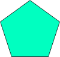

# akashic-box2dモジュールの利用

この文書は akashic-box2d@2.3.0 以前のものです。

## これは

Akashic上で2D物理エンジンを実行するための akashic-box2d@2.3.0 とその利用方法を記述したドキュメントです。

akashic-box2dは、2D物理演算ライブラリである[Box2DWeb](https://github.com/hecht-software/box2dweb)をAkashicで利用するためのモジュールです。

本モジュールは**AkashicとBox2DWebとの紐づけ**と**一部の便利機能**のみを提供しています。
そのため、その他多くの機能はBox2DWebを直接利用することになります。

sampleディレクトリに本モジュールを使ったサンプルコンテンツが用意してあります。
実装例についてはそちらを参照してください。

## 準備

Akashicを使ったゲーム開発の準備が終わっていない場合は、
[Akashicを利用したゲーム開発](https://akashic-games.github.io/tutorial/v2/)を読んでゲーム開発の環境を整えて下さい。

akashic-box2dはAkashicの拡張機能として提供されています。

インストールには、akashic-cliを使用します。
game.json が置かれているディレクトリで以下のコマンドを実行してください。

```sh
akashic install @akashic-extension/akashic-box2d
```

このコマンドは `npm install --save @akashic-extension/akashic-box2d` を行い、その後 game.json の globalScripts フィールドを更新します。
(game.json の詳細は [game.jsonの仕様](https://akashic-games.github.io/guide/game-json.html) を参照してください)

akashic-box2dを利用したいシーンで以下の様に `require` を行います。

```javascript
var b2 = require("@akashic-extension/akashic-box2d");
```

本ドキュメントのサンプルコードでは、akashic-box2dの機能は `b2` 変数を経由して呼び出すことになります。

## 初期化

まず、`scene.loaded` 時に `Box2D` クラスのインスタンスである `box2d` を生成します。

`Box2D` は、Box2DWebの機能をAkashic上で管理するためのクラスです。

```javascript
scene.loaded.add(function() {
    var box2d = new b2.Box2D({
      gravity: [0, 9.8],
      scale: 50
    });
    ...
}
```

`Box2D` クラスのインスタンス生成時に、物理エンジンの世界の設定である `gravity` と `scale` の指定が必須になります。

`gravity` は重力加速度の方向を示します。 `gravity: [0, 9.8]` はx軸方向に0、y軸方向に9.8 \[m/s^2\] の重力を生成することを意味します。

`scale` は1メートルのピクセル数を示します。 `scale: 50` は1メートルがAkashicの描画領域内の50ピクセルの長さにスケールされた上で物理演算処理がされることを意味します。

以上で物理エンジンの世界が生成され、akashic-box2dを使用する準備ができました。

## ボディの追加

### 自然落下するボディの生成

akashic-box2dでは、物理演算対象のエンティティを管理するオブジェクトを *ボディ* と呼び、このボディを用いて各種操作を行います。

ボディを作成するには、まずボディの元になるエンティティを作成します。

```javascript
var entity = new g.FilledRect({scene: scene, cssColor: "red", width: game.width, height: 50, x: 100, y: 0});
scene.append(entity);
entity.modified();
```

ここでは `g.FilledRect` を生成していますが、
 `g.Sprite` や `g.Label` などAkashicが提供するエンティティであれば何でも物理演算の対象にできます。

このエンティティを物理演算の対象とするには、まずボディの性質を定義する必要があります。
akashic-box2dでは、ボディの性質として以下の要素があります。

* 密度 \[kg/m^2\]
* 摩擦係数
* 反発係数
* 形状

これらの性質は `box2d.createFixtureDef()` により設定できます。

```javascript
var entityFixDef = box2d.createFixtureDef({
  density: 1.0, // 密度
  friction: 0.5, // 摩擦係数
  restitution: 0.3, // 反発係数
  shape: box2d.createRectShape(floorEntity.width, floorEntity.height) // 形状
});
```

`box2d.createRectShape()` は対象のエンティティが四角であることを定義します。

次に、ボディタイプを設定します。
ボディタイプには以下の要素があります。

* 静止物体 (`b2_staticBody`)
* キネマティック物体 (`b2_kinematicBody`)
* 動的物体 (`b2_dynamicBody`)

基本的には静止物体か動的物体かを選択します。

静止物体は、そのボディにどんなに強力な外的力が加わってもその場所に固定されます。
動的物体は、物理演算により座標や角度などが変化するボディです。

ここではボディタイプを `b2_dynamicBody` に設定しましょう。

```javascript
var entityDef = box2d.createBodyDef({
  type: b2.b2_dynamicBody
});
```

以上でボディの作成準備が整いました。

次に、 `box2d.createBody()` を利用してエンティティに紐づいたボディを作成し、そのボディを物理エンジンの世界へ追加します。

`box2d.createBody()` の戻り値は、ボディを示す `b2.EBody` のインスタンスです。
`b2.EBody` はエンティティ `entity` とb2Body `b2Body` のインスタンスをメンバとして所持しています。

```javascript
var body = box2d.createBody(entity, entityDef, entityFixDef);
```

`box2d.step()` で物理エンジンの世界の時間を進め、同時にボディと紐づけられたエンティティの座標と角度を変更します。
このメソッド内では暗黙的に `E#modified()` が呼ばれるため、ユーザが明示的に `E#modified()` を呼び出す必要はありません。

```javascript
scene.update.add(function() {
  // 物理エンジンの世界を進める
  box2d.step(1 / game.fps);
});
```

引数には進める時間を指定します。

それではゲームを実行してみましょう。
赤い四角が自然落下により落ちていく様子が見られると思います。

### 地面の生成

このままではボディが延々と落ち続けてしまうため、地面を作成しましょう。

まず地面となるエンティティを作成します。

```javascript
var floorEntity = new g.FilledRect({scene: scene, cssColor: "black", width: game.width, height: 50, y: game.height - 50});
scene.append(floorEntity);
floorEntity.modified();
```

性質は先ほどのエンティティと同じにします。

```javascript
var floorFixDef = box2d.createFixtureDef({
  density: 1.0, // 密度
  friction: 0.5, // 摩擦係数
  restitution: 0.3, // 反発係数
  shape: box2d.createRectShape(floorEntity.width, floorEntity.height) // 形状
});
```

`floorEntity` を地面とするため、ボディタイプをStaticに設定しましょう。

```javascript
var floorDef = box2d.createBodyDef({
  type: b2.b2_staticBody
});
```

物理エンジンの世界に `floor` を追加します。

```javascript
var floorBody = box2d.createBody(floor, floorDef, floorFixDef);
```

これで地面が生成できました。

### 他の形状のボディ生成

akashic-box2dでは、四角の他に**円**や**多角形**の形状を定義することができます。

#### 円のボディ作成

円は `box2d.createCircleShape()` で定義できます。引数には直径を与えます。

```javascript
var circleDef = box2d.createFixtureDef({
  shape: box2d.createCircleShape(circle.width) // 形状を円として定義
});
```

以下のサッカーボールを物理エンジンの世界に追加するには、次のようにボディを定義します。


 
```javascript
var ball = new g.Sprite({scene: scene, src: scene.assets.ball, width: 100, height: 100});
scene.append(ball);
ball.modified();

ballDef = box2d.createFixtureDef({
  shape: box2d.createCircleShape(ball.width)
});
```

#### 多角形のボディ作成

多角形は `box2d.createPolygonShape()` で定義できます。引数には各頂点の座標の `b2Vec` を格納した配列を与えます。

```javascript
// 頂点の定義
var vertices = [
  box2d.vec2(-10, -10),
  box2d.vec2(5, -10),
  box2d.vec2(10, 0),
  box2d.vec2(0, 10),
  box2d.vec2(-5, 5),
];

var polygonDef = box2d.createFixtureDef({
  shape: box2d.createPolygonShape(vertices) // 頂点から構成される形状を多角形として定義
});
```

`box2d.vec()` はBox2DWebの `b2Vec2` クラスのインスタンスを生成する関数で、第1引数にはx方向のピクセル数、第2引数にy方向のピクセル数を指定します。

以下の正五角形を物理エンジンの世界に追加するには、次のようにボディを定義します。



```javascript
var pentagon = new g.Sprite({scene: scene, src: scene.assets.pentagon, width: 100, height: 95});
scene.append(pentagon);
pentagon.modified();

var vertices = [
  box2d.vec2(0, -48),
  box2d.vec2(50, -12),
  box2d.vec2(30, 48),
  box2d.vec2(-32, 48),
  box2d.vec2(-50, -12),
];

pentagonDef = box2d.createFixtureDef({
  shape: box2d.createPolygonShape(vertices);
});
```

頂点の座標は**必ず時計回り**に指定する必要があります。
また、いずれかの頂点の角度が180度を超えてしまう(凹形の)多角形は定義できません。
この制約はakashic-box2dが利用しているBox2Dの仕様によるものです。

もう一つの注意点として、多角形の各頂点は**必ずエンティティの中心からの相対座標**で指定する必要があります。
エンティティの中心とは `(entity.width / 2, entity.height / 2)` であり、重心ではないことに留意してください。

## ボディの操作

このままではボディが落下するだけで面白くありません。
そこで、ボディに対して動的な力を加えてみようと思います。

ボディの操作には[Box2DのAPI](http://box2d.org/documentation.html)を直接利用します。

そのためには `b2Body` インスタンスが必要になります。
b2Bodyインスタンスは `body.b2Body` により取得できます。

```javascript
body = box2d.createBody( ... );
var b2Body = body.b2Body;
```

Box2DWebでは、例えばボディに対して瞬間的な力を加える `ApplyLinearImpulse()` があります。
先ほどの `body` をクリックすると、右上方向の力を加えるように修正してみましょう。

```javascript
entity.touchable = true;
entity.pointDown.add(function(o) {
  b2Body.ApplyLinearImpulse(box2d.vec2(50, -50), body.GetPosition());
});
```

`ApplyLinearImpulse()` の第1引数には力の方向、第2引数には力の作用点を指定します。

上記の場合、 `body` の中心に対して `(50 [kg*px/s], -50 [kg*px/s])` の力を加える事を意味します。

注意点として、以下のコードでは意図通りには動作しません。

```javascript
entity.touchable = true;
entity.pointDown.add(function(o) {
  b2Body.ApplyLinearImpulse(box2d.vec2(50, -50), box2d.vec2(body.x, body.y));
});
```

詳しくは後述しますが、これはBox2Dのボディの座標基準が中央であるのに対し、
Akashicではボディの座標基準が左上になっているために生じます。
このコードではボディの左上に対して力を加えてしまうため、意図通りの動作をしてくれません。

Akashicの座標基準で指定するには、 `ApplyLinearImpulse()` の第2引数を次のように修正する必要があります。

```javascript
entity.touchable = true;
entity.pointDown.add(function(o) {
  b2Body.ApplyLinearImpulse(box2d.vec2(50, -50), box2d.vec2(body.x + body.width / 2, body.y + body.height / 2));
});
```

他にも `SetLinearVelocity()` という関数もあります。この関数は力ではなくボディの速度を直接操作します。

```javascript
entity.touchable = true;
entity.pointDown.add(function(o) {
  b2Body.SetLinearVelocity(box2d.vec2(50, -50));
});
```

## 接触イベントの検出

### 単一ボディ同士の接触イベント検出

ボディ同士の接触イベントを設定してみましょう。

まず、Box2Dを利用して接触イベントのリスナーを生成します。
`b2.Box2DWeb` からBox2DWebのインスタンスを直接参照できます。

以下のようにBox2DWebのインスタンスから `b2ContactListener` を生成します。

```javascript
var contactListener = new b2.Box2DWeb.Dynamics.b2ContactListener;
```

`b2ContactListener`に`BeginContact`イベントを追加します。

```javascript
contactListener.BeginContact = function (contact) {
  if (box2d.isContact(body1, body2, contact)) {
    ...
  }
}
```

`BeginContact` はいずれかのボディ同士が接触を開始した際に実行されます。

他にも以下のイベントが定義されています。
詳しくは[Box2DのAPI](http://www.box2dflash.org/docs/2.1a/reference/Box2D/Dynamics/b2ContactListener.html)
を参照してください。

* EndContact
* PostSolve
* PreSolve

`box2d.isContact()` は引数に指定したボディ同士の接触判定を返します。

設定したイベントリスナーを `box2d` の保持する物理エンジンの世界に設定します。

`box2d` の保持する物理エンジンの世界は `box2d.world` で参照できます。

```javascript
box2d.world.SetContactListener(contactListener);
```

例として、body1とbody2が接触している間だけbody1の色を赤にするコードを記載します。

```javascript
// 接触イベントのリスナーを生成
var contactListener = new b2.Box2DWeb.Dynamics.b2ContactListener;
// 接触開始時のイベントリスナー
contactListener.BeginContact = function (contact) {
  // body1とbody2がぶつかったらbodyEntity1の色を赤にする
  if (box2d.isContact(body1, body2, contact)) {
    bodyEntity1.cssColor = "red";
    bodyEntity1.modified();
  }
}
// 接触が離れた時のイベントリスナー
contactListener.EndContact = function (contact) {
  // body1とbody2が離れたらbodyEntity1の色を戻す
  if (box2d.isContact(body1, body2, contact)) {
    bodyEntity1.cssColor = "...";
    bodyEntity1.modified();
  }
}
// イベントリスナーを設定
box2d.world.SetContactListener(contactListener);
```

### 複数ボディ同士の接触イベント検出
上述した方法では単一のボディ同士の接触しか判定できないため、接触を判定したいボディが多数存在する場合は非常に手間がかかります。

`box2d.isContact()` では接触判定にBox2DWebの**ユーザデータ**を使用しています。
多数のボディに対して接触判定をさせるためには、ユーザデータを明示的に指定する必要があります。

ユーザデータはボディの定義時に指定することができます。

```javascript
var bodyDef = createBodyDef({
  userData: "hoge"
});
```

`userData` を省略した場合、ユーザデータはエンティティのIDが利用されます。

`body1`、`body2`、`body3`が`body`と接触したことを判定するコードは以下のようになります。

```javascript
body1Def = createBodyDef({
  userData: "target"
});
body2Def = createBodyDef({
  userData: "target"
});
body3Def = createBodyDef({
  userData: "target"
});

...

// 接触イベントのリスナーを生成
var contactListener = new b2.Box2DWeb.Dynamics.b2ContactListener;
// 接触開始時のイベントリスナー
contactListener.BeginContact = function (contact) {
  if (box2d.isContact(body1, body, contact)) {
    ...
  }
}
// イベントリスナーを設定
box2d.world.SetContactListener(contactListener);
```

`box2d.isContact()`の第1引数には`body1`しか指定していませんが、`body1`のユーザデータは`body2`と`body3`と同様のため、
`body1`〜`body3`と`body`との接触を判定できます。

なお、接触したボディ`bodyA`、`bodyB`を別途に取得したい場合は以下のようにします。

```javascript
contactListener.BeginContact = function (contact) {
  var bodyA = contact.GetFixtureA().GetBody();
  var bodyB = contact.GetFixtureB().GetBody();
}

```

## 物理エンジンの操作

### 物理エンジンからボディの破棄
物理エンジンの世界に追加したボディを破棄するには `box2d.removeBody()` を利用します。

```javascript
box2d.removeBody(body);
```

`box2d.removeBody()`が呼ばれるとその時点で第1引数に指定したボディは破棄され、
そのボディと紐づけられたエンティティだけが残ります。

### 物理エンジンの破棄
`box2d` を破棄するには `box2d.destroy()` を利用します。

```javascript
box2d.destroy();
```

`box2d.destroy()` が呼ばれると、その時点で物理エンジンの世界は破棄されます。
`box2d` に紐づけられたボディはすべて破棄され、エンティティだけが残ります。

## Box2D(Box2DWeb)へのパッチの適用

Box2D(Box2DWeb) の機能を追加・変更するためのパッチが用意されています。パッチは２つあります。

### patchBox2D

以下の修正が適用されます。

* 無限ループに陥る不具合の修正。
* 物理計算の時間を制限するため、最小TOI算出ループの繰り返し回数の上限を設定する機能の追加。

使い方は以下のようになります。詳しくは [patch/index.d.ts](./patch/index.d.ts) のコメントを御覧ください。

```javascript
var patch = require("@akashic-extension/akashic-box2d/patch");

var box2d = new b2.Box2D( ... );

patch.patchBox2D(box2d, { maxTOILoop: 10 });
```

### patchBox2DMath

以下の修正が適用されます。

* 一部環境で三角関数の計算結果が異なる問題を回避するため、関数テーブルを用いる。

使い方は以下のようになります。詳しくは [patch/index.d.ts](./patch/index.d.ts) のコメントを御覧ください。

```javascript
var patch = require("@akashic-extension/akashic-box2d/patch");

patch.patchBox2DMath(box2d, { tableSize: 8192 });
```

## 注意事項

### 単位の違い

前述しましたが、Box2D(Box2DWeb)は以下の点でAkashicと差異があります。

* ボディの座標基準がボディの中央
* 長さの単位がメートル
* 角度の単位がラジアン

したがって、以下のコードは意図しない結果となります。

```javascript
entity.angle = b2Body.GetAngle(); // GetAngle()はBox2DWebでのボディの角度をラジアンで取得する関数
b2Body.SetAngle(entity.angle); // SetAngle()はBox2DWebでのボディの角度をラジアンで設定する関数
```

`box2d` はこれら単位の違いを変換するための関数を用意しています。

`box2d.degree(radian)` はラジアンを度に、 `box2d.radian(degree)` は度をラジアンに変換します。
先ほど例として出した `box2d.vec(x, y)` も、ピクセル単位をメートル単位に変換したBox2DWebの `b2Vec` インスタンスを返します。

### エンティティからボディへの操作

akashic-box2d 0.1.0では、ゲーム開発者側から物理エンジンの世界に追加されたエンティティの座標と角度を操作することができません。

ボディの座標を(100, 100)に指定したい場合、Box2DWebの `SetPosition()` により指定します。

```javascript
// NG: 物理演算結果の座標が上書きされます。
entity.x = 100;
entity.y = 100;
entity.angle = 180;

// OK
b2Body.SetPosition(box2d.vec2(100 + entity.width / 2, 100 + entity.height / 2));
b2Body.SetAngle(box2d.radian(180));
```

Box2Dのボディの座標基準は中心にあるため、エンティティの `width` と `height` から座標を補正する必要があります。
